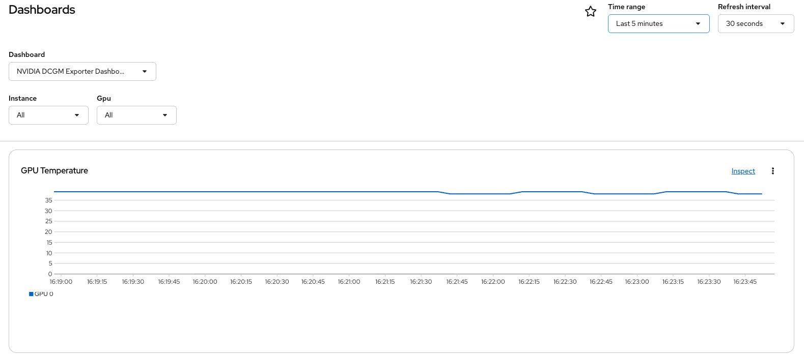

# GPU Configuration

## Prerequisites

* **GPU-enabled worker nodes** with NVIDIA L40S GPUs
* **Node Feature Discovery operator (Red Hat)** for hardware detection
* **NVIDIA GPU Operator operator (NVIDIA)** for automated GPU resource management
* **Custom configurations** for production GPU workloads

## Step 1: Clone the Repository

```bash
git clone https://github.com/rh-aiservices-bu/ocp-gpu-setup.git
cd ocp-gpu-setup
```

## Step 2: Configure GPU Machine Sets

The machine set script creates AWS EC2 instances with GPU support and configures them as OpenShift worker nodes.

```bash
./machine-set/gpu-machineset.sh
```

**Configuration options:**
1. Select "12) L40S Single GPU" - Creates nodes with NVIDIA L40S GPUs
2. Choose "p" for private - Internal GPU access (vs "s" for shared/external)
3. Enter AWS region, probably "us-east-2" - AWS region for deployment
4. Enter Availability zone e.g. "1" - AZ within the region (1, 2, or 3)
5. Answer "n" for spot instances - Use on-demand instances for stability

**What this does:**
- Creates GPU-enabled EC2 instances (g6.2xlarge for L40 or g6e.2xlarge for L40S)
- Applies `nvidia.com/gpu` taints to GPU nodes
- Adds appropriate accelerator labels for workload scheduling
- Configures networking and security groups

**Note:** Check if you have the default machineset available. If not, run the command twice.

**Scaling configuration:**
- Set the GPU MachineSet to **2 instances** (for GPU workloads)
- Configure the default MachineSet to **6 instances** (for non-GPU workloads)

Wait for nodes to be provisioned (typically 5-10 minutes).

## Step 2: Deploy Node Feature Discovery (NFD)

* Install the NFD Operatior provided by Red Hat
* Create a **NodeFeatureDiscovery** instance
* Check if pci-10de (NVIDIA ID) are available on OpenShit nodes

```
oc get nodes -l 'feature.node.kubernetes.io/pci-10de.present=true'
NAME                                       STATUS   ROLES    AGE     VERSION
ip-10-0-38-13.us-east-2.compute.internal   Ready    worker   5m28s   v1.35.6
```

**What this deploys:**
- **Namespace**: `openshift-nfd` with cluster monitoring
- **Operator**: Red Hat NFD operator (v4.18.0)
- **Configuration**: Scans nodes every 60 seconds for PCI devices including GPUs


## Step 3: Deploy NVIDIA GPU Operator

The GPU Operator automates the management of NVIDIA GPU software stack.

* Install the certified NVIDIA GPU Operatior provided by NVIDIA
* Create a default **ClusterPolicy** instance
* Check if NVIDIA Operator components are ready
```
oc get pods,daemonset -n nvidia-gpu-operator
NAME                                               READY   STATUS      RESTARTS   AGE
pod/gpu-feature-discovery-zzsmj                    1/1     Running     0          4m52s
pod/gpu-operator-798f4c5d9d-kqhfm                  1/1     Running     0          7m16s
pod/nvidia-container-toolkit-daemonset-tjqv5       1/1     Running     0          4m52s
pod/nvidia-cuda-validator-58k2l                    0/1     Completed   0          97s
pod/nvidia-dcgm-dj5mm                              1/1     Running     0          4m52s
pod/nvidia-dcgm-exporter-mbsc9                     1/1     Running     0          49s
pod/nvidia-device-plugin-daemonset-fhrxq           1/1     Running     0          4m52s
pod/nvidia-driver-daemonset-9.8.20260727-0-4c4s2   2/2     Running     0          5m2s
pod/nvidia-node-status-exporter-4gvbs              1/1     Running     0          4m58s
pod/nvidia-operator-validator-l2sg4                1/1     Running     0          4m52s

NAME                                                     DESIRED   CURRENT   READY   UP-TO-DATE   AVAILABLE   NODE SELECTOR                                                                                                  AGE
daemonset.apps/gpu-feature-discovery                     1         1         1       1            1           nvidia.com/gpu.deploy.gpu-feature-discovery=true                                                               4m59s
daemonset.apps/nvidia-container-toolkit-daemonset        1         1         1       1            1           nvidia.com/gpu.deploy.container-toolkit=true                                                                   5m1s
daemonset.apps/nvidia-dcgm                               1         1         1       1            1           nvidia.com/gpu.deploy.dcgm=true                                                                                5m
daemonset.apps/nvidia-dcgm-exporter                      1         1         0       1            0           nvidia.com/gpu.deploy.dcgm-exporter=true                                                                       5m
daemonset.apps/nvidia-device-plugin-daemonset            1         1         1       1            1           nvidia.com/gpu.deploy.device-plugin=true                                                                       5m1s
daemonset.apps/nvidia-device-plugin-mps-control-daemon   0         0         0       0            0           nvidia.com/gpu.deploy.device-plugin=true,nvidia.com/mps.capable=true                                           5m
daemonset.apps/nvidia-driver-daemonset-9.8.20260727-0    1         1         1       1            1           feature.node.kubernetes.io/system-os_release.OSTREE_VERSION=9.8.20260727-0,nvidia.com/gpu.deploy.driver=true   5m2s
daemonset.apps/nvidia-mig-manager                        0         0         0       0            0           nvidia.com/gpu.deploy.mig-manager=true                                                                         4m59s
daemonset.apps/nvidia-node-status-exporter               1         1         1       1            1           nvidia.com/gpu.deploy.node-status-exporter=true                                                                4m58s
daemonset.apps/nvidia-operator-validator                 1         1         1       1            1           nvidia.com/gpu.deploy.operator-validator=true   
```

**What this deploys:**
- **Namespace**: `nvidia-gpu-operator`
- **Operator**: NVIDIA GPU Operator (v26.3.3) from certified operators
- **Components**: GPU drivers, container runtime, device plugins, monitoring


## Step 4: Enable GPU Observability (Optionnal)

1. Download the latest NVIDIA DCGM Exporter Dashboard from the DCGM Exporter repository on GitHub:
```
curl -LfO https://github.com/NVIDIA/dcgm-exporter/raw/main/grafana/dcgm-exporter-dashboard.json
```

2. Create a config map from the downloaded file in the openshift-config-managed namespace:
```
oc create configmap nvidia-dcgm-exporter-dashboard -n openshift-config-managed --from-file=dcgm-exporter-dashboard.json
```

3. Label the config map to expose the dashboard in the Administrator perspective of the web console:
```
oc label configmap nvidia-dcgm-exporter-dashboard -n openshift-config-managed "console.openshift.io/dashboard=true"
```

4. Optional: Label the config map to expose the dashboard in the Developer perspecitive of the web console:
```
oc label configmap nvidia-dcgm-exporter-dashboard -n openshift-config-managed "console.openshift.io/odc-dashboard=true"
```

5. View the created resource and verify the labels:
```
oc -n openshift-config-managed get cm nvidia-dcgm-exporter-dashboard --show-labels
NAME                             DATA   AGE   LABELS
nvidia-dcgm-exporter-dashboard   1      16s   console.openshift.io/dashboard=true
```
6. New Dashboard in OpenShift Observability stack



## Step 4: Deploy Custom Resources (CRs)

The CRs configure how NFD and the GPU Operator should operate in your cluster.

```bash
oc apply -f ./crs
```

**What this configures:**

### Node Feature Discovery Configuration
- **Hardware Detection**: Identifies NVIDIA GPUs and other PCI devices
- **Node Labeling**: Adds vendor and device information as node labels
- **Scheduling**: Enables GPU-aware pod scheduling

### GPU Cluster Policy
- **Driver Management**: Automatic NVIDIA driver installation and updates
- **Monitoring**: DCGM (Data Center GPU Manager) for GPU metrics
- **Device Plugin**: Exposes GPU resources to Kubernetes scheduler
- **MIG Support**: Multi-Instance GPU configuration capability
- **Validation**: GPU functionality testing and validation

### Driver Configuration
- **Container Image**: Specific NVIDIA driver version with SHA256 verification
- **Registry**: Uses NVIDIA's official container registry
- **Integration**: OpenShift driver toolkit compatibility

## Verification

After deployment, verify your GPU setup:

```bash
# Check GPU nodes
oc get nodes -l nvidia.com/gpu.present=true

# Check GPU operator pods
oc get pods -n nvidia-gpu-operator

# Check NFD labels on GPU nodes
oc describe node <gpu-node-name> | grep nvidia

# Check available GPU resources
oc describe node <gpu-node-name> | grep nvidia.com/gpu
```

## Supported GPU Types

The setup script supports 14 different GPU configurations including:
- Tesla T4, A10G, A100 (various configurations)
- H100 (80GB and 94GB variants)
- L40, L40S (single and multi-GPU)
- V100 and other enterprise GPUs

## Architecture

```
┌─────────────────┐    ┌──────────────────┐    ┌─────────────────┐
│   NFD Operator  │    │  GPU Operator    │    │ Custom Resources│
│                 │    │                  │    │                 │
│ • Node scanning │    │ • Driver mgmt    │    │ • NFD config    │
│ • Hardware      │    │ • Device plugin  │    │ • Cluster policy│
│   detection     │    │ • Monitoring     │    │ • Driver spec   │
│ • Node labeling │    │ • Validation     │    │                 │
└─────────────────┘    └──────────────────┘    └─────────────────┘
         │                       │                       │
         └───────────────────────┼───────────────────────┘
                                 │
                    ┌─────────────────────┐
                    │   GPU Worker Nodes  │
                    │                     │
                    │ • NVIDIA L40S GPUs  │
                    │ • Specialized taints│
                    │ • GPU-ready runtime │
                    │ • Monitoring agents │
                    └─────────────────────┘
```

## Step 5: Add a taint to node with GPU

A taint allows the possibility to dedicate some specific nodes (with GPU for example) to specific workloads (AI workload with GUP needs for example).

**We have to taint specific nodes with specifics keys to do that:**
```
  taints:
    - key: nvidia.com/gpu
      value: NVIDIA-L40S-PRIVATE
      effect: NoSchedule
```

