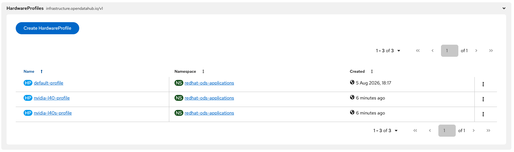
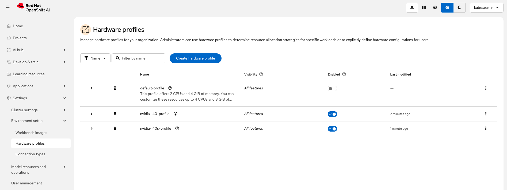

# Hardware profiles

In Red Hat OpenShift AI, you can use hardware profiles to manage and allocate specific hardware resources, such as hardware accelerators, specialized memory, or CPU-only nodes for data science, machine learning, and generative AI workloads.

Hardware profiles are based on Taints and Tolerations and can be created on the OpenShift AI WebUI or via YAML files.

## Hardware profiles definition

1. **NVIDIA L40 profil**
```
apiVersion: infrastructure.opendatahub.io/v1
kind: HardwareProfile
metadata:
  name: nvidia-l40-profile
  namespace: redhat-ods-applications
spec:
  identifiers:
    - defaultCount: 2
      displayName: CPU
      identifier: cpu
      maxCount: 4
      minCount: 1
      resourceType: CPU
    - defaultCount: 4Gi
      displayName: Memory
      identifier: memory
      maxCount: 16Gi
      minCount: 2Gi
      resourceType: Memory
    - defaultCount: 1
      displayName: Accelerator
      identifier: nvidia.com/gpu
      maxCount: 4
      minCount: 1
      resourceType: Accelerator
  scheduling:
    node:
      nodeSelector: {}
      tolerations:
        - effect: NoSchedule
          key: nvidia.com/gpu
          operator: Equal
          value: NVIDIA-L40-SHARED
    type: Node
```

2. **NVIDIA L40S profil**
```
apiVersion: infrastructure.opendatahub.io/v1
kind: HardwareProfile
metadata:
  name: nvidia-l40s-profile
  namespace: redhat-ods-applications
spec:
  identifiers:
    - defaultCount: 2
      displayName: CPU
      identifier: cpu
      maxCount: 4
      minCount: 1
      resourceType: CPU
    - defaultCount: 4Gi
      displayName: Memory
      identifier: memory
      maxCount: 16Gi
      minCount: 2Gi
      resourceType: Memory
    - defaultCount: 1
      displayName: Accelerator
      identifier: nvidia.com/gpu
      maxCount: 4
      minCount: 1
      resourceType: Accelerator
  scheduling:
    node:
      nodeSelector: {}
      tolerations:
        - effect: NoExecute
          key: nvidia.com/gpu
          operator: Equal
          value: NVIDIA-L40S-SHARED
    type: Node
```

## Hardware profile CRD in OpenShift WebUI


## Hardware profile in OpenShift AI WebUI
