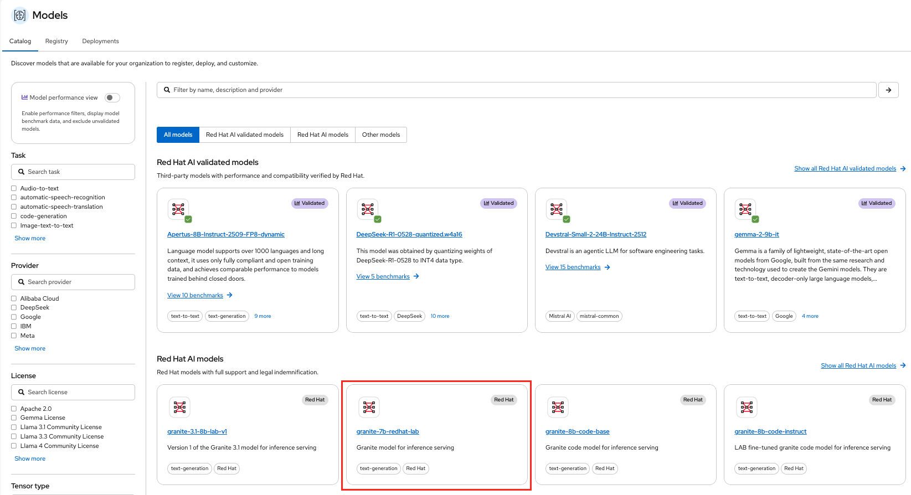
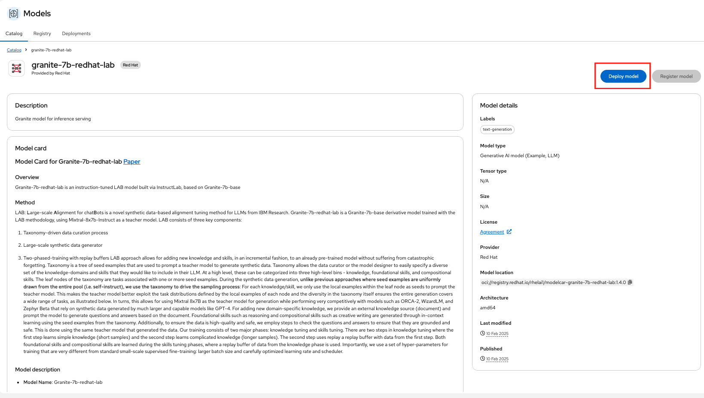
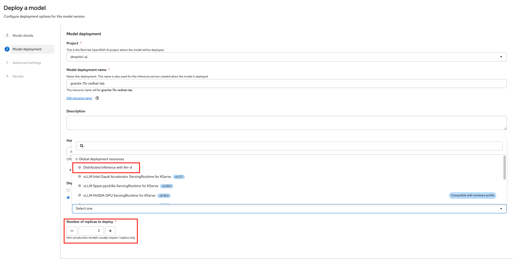
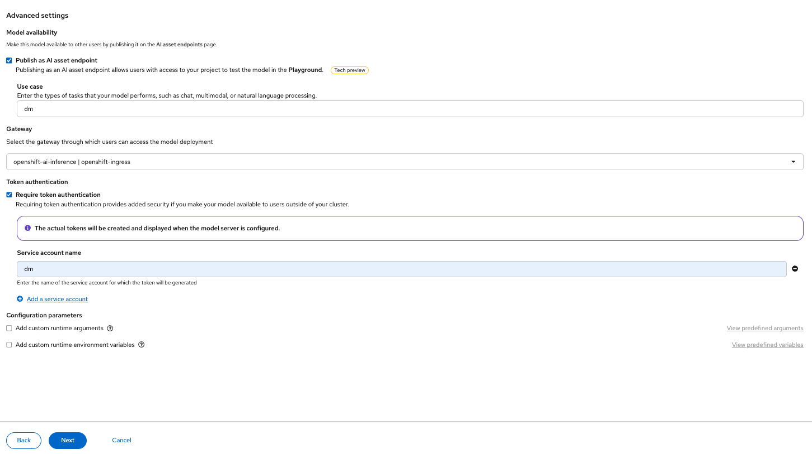
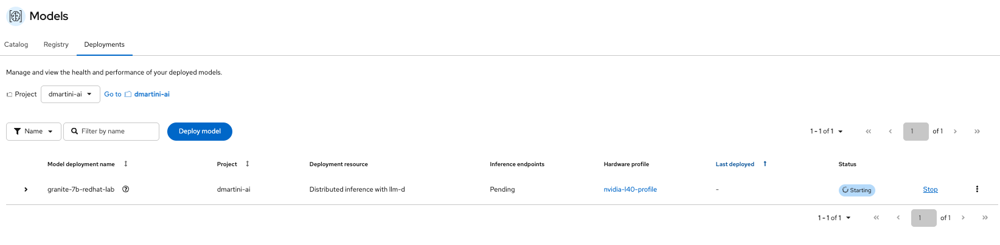
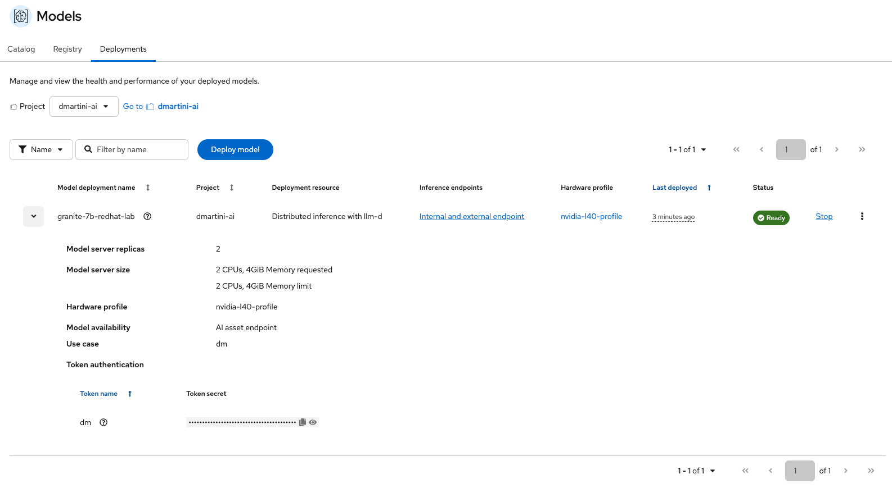
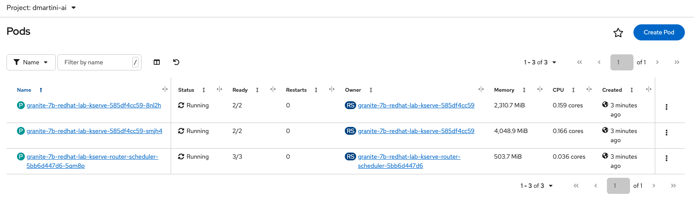

# LLM Inference on OpenShift AI


## llm-d and distributed inference

**Official documentation:** https://docs.redhat.com/en/documentation/red_hat_openshift_ai_self-managed/3.4/html/deploy_models_using_distributed_inference_with_llm-d/index

### Gateway Configuration

1. Create a GatewayClass
```
apiVersion: gateway.networking.k8s.io/v1
kind: GatewayClass
metadata:
  name: openshift-default
spec:
  controllerName: openshift.io/gateway-controller/v1
```

2. Create a Gateway config
```
apiVersion: v1
kind: ConfigMap
metadata:
  name: openshift-ai-inference-gateway-options
  namespace: openshift-ingress
data:
  deployment: |
    spec:
      template:
        spec:
          containers:
          - name: istio-proxy
            resources:
              requests:
                cpu: 100m
                memory: 256Mi
              limits:
                cpu: "2"
                memory: 2Gi
```

3. Create a Gateway
```
apiVersion: gateway.networking.k8s.io/v1
kind: Gateway
metadata:
  name: openshift-ai-inference
  namespace: openshift-ingress
spec:
  gatewayClassName: openshift-default
  infrastructure:
    parametersRef:
      group: ""
      kind: ConfigMap
      name: openshift-ai-inference-gateway-options
  listeners:
  - name: http
    protocol: HTTP
    port: 80
    allowedRoutes:
      namespaces:
        from: All
  - name: https
    protocol: HTTPS
    port: 443
    allowedRoutes:
      namespaces:
        from: All
    tls:
      mode: Terminate
      certificateRefs:
      - kind: Secret
        name: router-certs-default
```

4. Enable Gateway discovery in the dashboard configuration
```
oc patch odhdashboardconfig odh-dashboard-config \
-n redhat-ods-applications \
--type merge \
-p '{"spec":{"dashboardConfig":{"llmGatewayField":true}}}'
```

### Authentication Configuration

1. Create the kuadrant-system namespace
```
kind: Namespace
apiVersion: v1
metadata:
  name: kuadrant-system
```

2. Create kuadrant CRD
```
apiVersion: kuadrant.io/v1beta1
kind: Kuadrant
metadata:
  name: kuadrant
  namespace: kuadrant-system
spec:
  # Enable observability so the Kuadrant operator creates its own
  # Limitador/Authorino PodMonitor/ServiceMonitor resources that are
  # scraped by user-workload monitoring. Required for MaaS observability.
  observability:
    enable: true
```

3. Add the ServingCert annotation to the Authorino Service
```
oc annotate svc/authorino-authorino-authorization  service.beta.openshift.io/serving-cert-secret-name=authorino-server-cert -n kuadrant-system
```

4. Update Authorino to enable SSL
```
oc apply -f - <<EOF
apiVersion: operator.authorino.kuadrant.io/v1beta1
kind: Authorino
metadata:
  name: authorino
  namespace: kuadrant-system
spec:
  replicas: 1
  clusterWide: true
  listener:
    tls:
      enabled: true
      certSecretRef:
        name: authorino-server-cert
  oidcServer:
    tls:
      enabled: false
EOF
```

5. Verify that the Authorino pods are ready
```
oc wait --for=condition=ready pod -l authorino-resource=authorino -n kuadrant-system --timeout 150s
```

6. If OpenShift AI was installed before installing Connectivity Link and Kuadrant, restart the controllers
```
oc delete pod -n redhat-ods-applications -l app=odh-model-controller
oc delete pod -n redhat-ods-applications -l control-plane=kserve-controller-manager
```

### Model deployement with llm-d via OpenShift AI WebUI
















### Test model inference


1. List model
```
curl -k -X GET "https://redhataiqwen25-7b-instruct-dmartini-ai.apps.cluster-kcpq5.kcpq5.sandbox3567.opentlc.com/v1/models" \
  -H "Authorization: Bearer <TOKEN>"
```

```
{"object":"list","data":[{"id":"redhataiqwen25-7b-instruct","object":"model","created":1787666362,"owned_by":"vllm","root":"/mnt/models","parent":null,"max_model_len":32768,"permission":[{"id":"modelperm-9f91915ff77a954b","object":"model_permission","created":1787666362,"allow_create_engine":false,"allow_sampling":true,"allow_logprobs":true,"allow_search_indices":false,"allow_view":true,"allow_fine_tuning":false,"organization":"*","group":null,"is_blocking":false}]}]}
```

2. Prompt model
```
curl -k -X POST "https://redhataiqwen25-7b-instruct-dmartini-ai.apps.cluster-kcpq5.kcpq5.sandbox3567.opentlc.com/v1/chat/completions" \
  -H "Content-Type: application/json" \
  -H "Authorization: Bearer <TOKEN>" \
  -d '{
    "model": "redhataiqwen25-7b-instruct",
    "messages": [
      {
        "role": "user",
        "content": "Bonjour, peux-tu te présenter brièvement ?"
      }
    ],
    "temperature": 0.7
  }'
```

3. Result
```
{"id":"chatcmpl-80640b2dc6e51097","object":"chat.completion","created":1787666426,"model":"redhataiqwen25-7b-instruct","choices":[{"index":0,"message":{"role":"assistant","content":"Bonjour ! Je m'appelle Qwen et je suis un assistant virtuel créé par Alibaba Cloud. Je suis ici pour vous aider avec toutes sortes de questions que vous pourriez avoir, de l'aide aux études aux informations générales, en passant par la rédaction de textes ou d'articles. N'hésitez pas à me poser des questions !","refusal":null,"annotations":null,"audio":null,"function_call":null,"tool_calls":[],"reasoning":null},"logprobs":null,"finish_reason":"stop","stop_reason":null,"token_ids":null}],"service_tier":null,"system_fingerprint":null,"usage":{"prompt_tokens":41,"total_tokens":122,"completion_tokens":81,"prompt_tokens_details":null},"prompt_logprobs":null,"prompt_token_ids":null,"kv_transfer_params":null}
```

### llm-d observability

1. Enable enableUserWorkload for OpenShift Observability
```
cat << EOF | oc create -f -
apiVersion: v1
kind: ConfigMap
metadata:
  name: cluster-monitoring-config
  namespace: openshift-monitoring
data:
  config.yaml: |
    enableUserWorkload: true
EOF
configmap/cluster-monitoring-config created
```