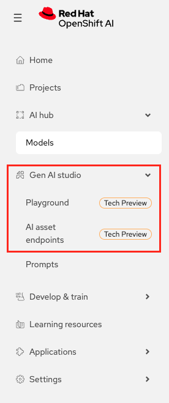
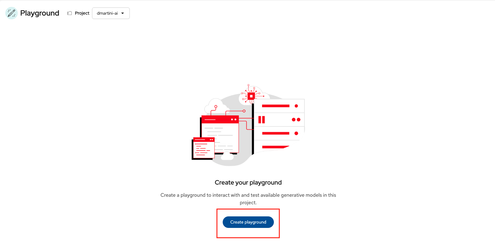
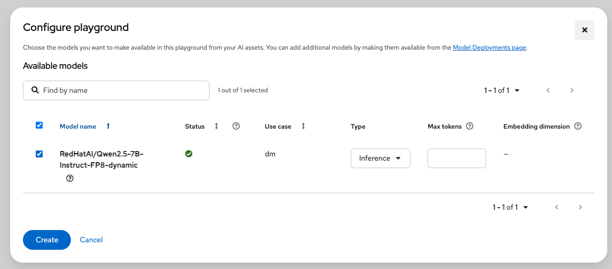
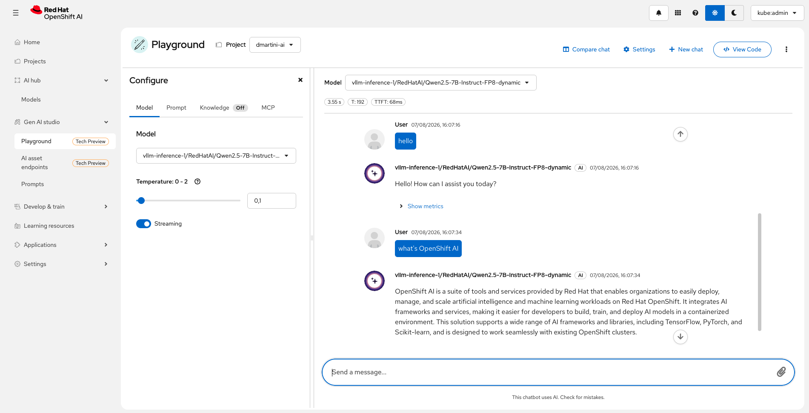

# Gen AI playground

**Official Documentation:** https://docs.redhat.com/en/documentation/red_hat_openshift_ai_self-managed/3.4/html/experimenting_with_models_in_the_gen_ai_playground/playground-overview_rhoai-user

## Enable Gen AI playground

1. Enable GenAI in OpenShift AI Dashboard CRD
```
apiVersion: opendatahub.io/v1alpha
kind: OdhDashboardConfig
metadata:
  name: odh-dashboard-config
spec:
  dashboardConfig:
    disableTracking: false
    llmGatewayField: true
    genAiStudio: true           <<<--- Add this line
  hardwareProfileOrder:
    - default-profile
    - nvidia-l40-profile
  notebookController:
    enabled: true
    notebookNamespace: rhods-notebooks
    pvcSize: 20Gi
  templateDisablement: []
  templateOrder: []
```

2. Enable the LLamaStack in default-dsc CRD
```
apiVersion: datasciencecluster.opendatahub.io/v2
kind: DataScienceCluster
metadata:
  name: default-dsc
spec:
  components:
    sparkoperator:
      managementState: Removed
    kserve:
      managementState: Managed
      modelsAsService:
        managementState: Removed
      nim:
        airGapped: false
        managementState: Managed
      rawDeploymentServiceConfig: Headless
      wva:
        managementState: Removed
    modelregistry:
      managementState: Managed
      registriesNamespace: rhoai-model-registries
    feastoperator:
      managementState: Managed
    trustyai:
      eval:
        lmeval:
          permitCodeExecution: deny
          permitOnline: deny
      managementState: Managed
      mcpGuardrailsMode: false
    aipipelines:
      argoWorkflowsControllers:
        managementState: Managed
      managementState: Managed
    ray:
      managementState: Managed
    kueue:
      defaultClusterQueueName: default
      defaultLocalQueueName: default
      managementState: Removed
    workbenches:
      managementState: Managed
      workbenchNamespace: rhods-notebooks
    mlflowoperator:
      managementState: Managed
    dashboard:
      managementState: Managed
    trainer:
      managementState: Managed
    llamastackoperator:
      managementState: Managed           <<<--- Change this line
    trainingoperator:
      managementState: Removed
```

3. Result







